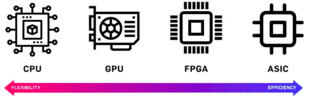
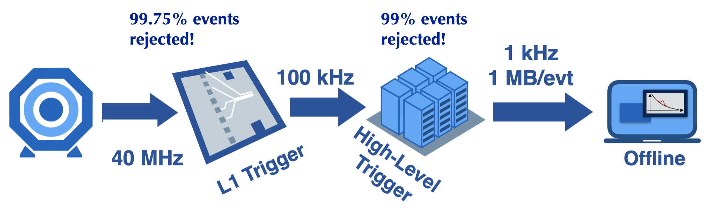

# What are FPGAs?

FPGAs stands for Field Programmable Gate Arrays, and they are digital integrated circuits (ICs) that contain programmable blocks of logic. A crucial feature of such devices is that they allow the acquisition of data at sub-microsecond and high data rates, while offering flexibility in terms of their functionality and low power usage. The following image depicts how the FPGAs compare with the more common CPUs and GPUs, as well as ASIC devices.

On the left side of the spectrum, devices like CPUs and GPUs have an internal architecture that is predetermined by the manufacturer, but which are created in a way that they can be reprogrammed to perform a variety of tasks.

On the opposite end of the spectrum are ASICs which contain hundreds of millions of logic gates. Thus, ASICs can be used to implement extremely complex functions. Although, the ultimate in complexity and performance, designing and building one is an extremely time-consuming and expensive process. In addition, once the final design is implemented, the ASIC device is "frozen in silicon." This means that the device cannot be modified or reconfigured without creating a new version.

As it can inferred, FPGAs lie in the middle of the spectrum for justified reasons. The functionality of FPGAs can be customized in the field without the need to replace the device, and they can contain millions of logic gates. Such advantages are important because they mean that FPGAs can be used to implement extremely large and complex functions that could only be realized using ASICs, while offering the flexibility to reprogram.

## Programming an FPGA:

There are three key and very different words that we should keep in mind before beginning the discussion about programming an FPGA. These words are: software, firmware, and hardware. Software refers to a set of instructions, data, or programs used to operate computers and execute specific tasks. Firmware refers to a set of instructions or program embedded into the memory of a physical device, which dictate the functionality of such a device. Hardware refers to the computer's or device's tangible components or delivery systems that store and run the written instructions provided by a program, like a piece of code for example.

Over the years, the hardware design process has evolved significantly. When circuits were small, hardware designers could specify the physical layout of wires, for instance. However, as our abilty to manufacture more complex hardware device increased, hardware designers began to rely on Electronic Design Automation (EDA) tools to help them implement more abstract specifications into the physical components of hardware devices. 

It was not common to use a programming language (e.g. Verilog or VHDL) to program devices like FPGAs until the 80's. Since that time, the hardware complexity has continued to increase and more abstract programming languages have been developed, such as Register Transfer Level (RTL) as an example. Yet another step in abstraction is High Level Synthesis (HLS) which has become really popular because we can use C/C++ to capture behavior in a hardware implementation. Some of the main steps to achieve this consist of some understanding of the (hardware) device architecture, C/C++ programming skills, and a HLS tool that will create the detailed RTL micro-architecture (firware). Such tools can be downloaded as will be shown after starting the tutorial. 

Keep in mind that, in general, HLS tools cannot handle arbitrary software code like normally done on C/C++. Many concepts that are common in software programming are difficult to implement in hardware. It typically requires additional information to be added by the designers (e.g. suggestions or `#pragmas`) that provide hints to the tool about how to create the most efficient firmware to run on our device. A small example is provided on the tutorial, which implements these ideas. 

# FPGAs at the CMS Detector

The Compact Muon Solenoid (CMS) comprises of a system of two triggers that select collision events in a live and offline basis. These two triggers are the High Level Trigger (HLT) and the Level 1 (L1) trigger. A significant difference between the two triggers to highlight in this discussion is that, on one hand, the HLT is a version of the CMS offline reconstruction software running on a computer farm made up of CPUs and GPUs. On the other hand, the L1 trigger is a custom hardware-software codesigned algorithm implemented on FPGAs. The workflow of the two-trigger system in the CMS detector is outlined in the figure below.

# Machine Learning on the Level-1 Trigger for Targeted Data Acquisition

Research involving these devices has become 
